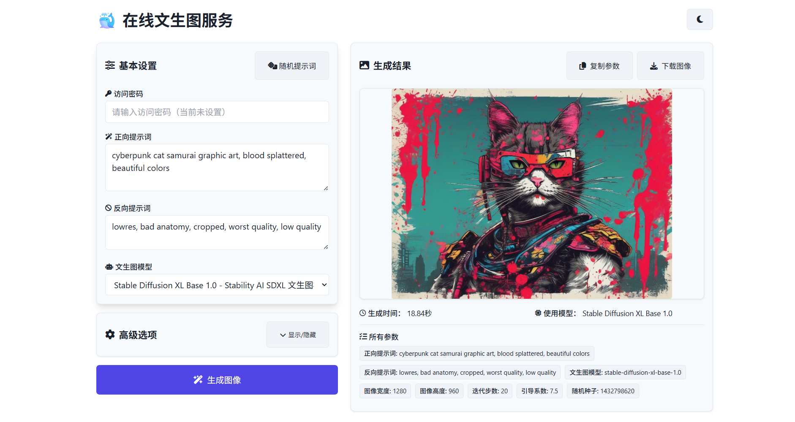
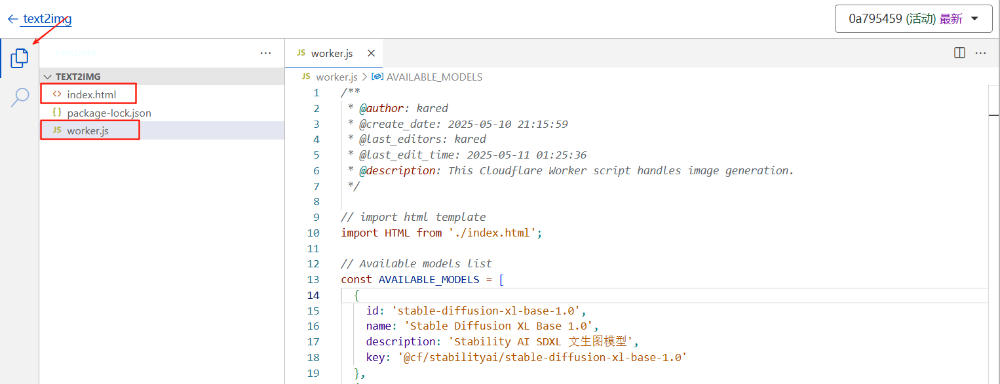
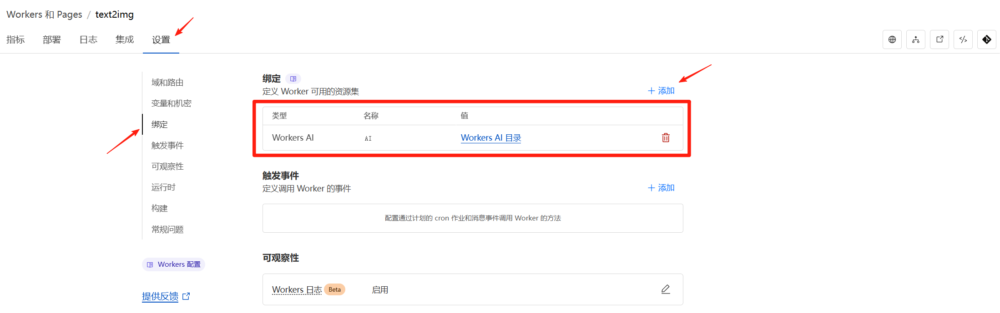

  

 

  <h1>
    ✨ 基于 Cloudflare AI & Workers 的免费在线文生图服务  
  </h1>

[项目简介](#📚-项目简介) |
[主要特性](#✨-主要特性) |
[快速开始](#🚀-快速开始) |
[使用指南](#📝-使用指南) |
[配置选项](#⚙️-配置选项) |
[模型限制](#📊-模型限制) |
[项目示例](https://text2img.huarzone.com/)

 

<picture>
  <source media="(prefers-color-scheme: dark)" srcset="public/top-dark.png">
  
</picture>

 

## 

Text2img-Cloudflare-Workers 是基于 Cloudflare Workers AI 服务搭建的在线文本生成图像可视化网页，完全构建在 Cloudflare Workers 上。该项目为通过简单调用 Cloudflare 官方提供的 [文生图 - Text-to-Image](https://developers.cloudflare.com/workers-ai/models/) 模型，可以快速实现随时随地无需登录的图像生成需求。

### 体验地址：[https://text2img.huarzone.com/](https://text2img.huarzone.com/)

## ✨ 主要特性

- 🚀 完全基于 Cloudflare Workers，无需服务器部署
- 🎨 利用 Cloudflare AI 提供免费高质量文生图模型
- 🐳 支持 FLUX/SDXL 等多个文生图模型
- ⚙️ 支持图像生成的高级选项设置
- 🤗 支持设置访问密码，私有化部署友好
- ⚡ 响应速度快，全球边缘网络加速
- 🌐 简洁的用户界面，易于使用
- 🌓 支持深色和浅色模式之间切换
- 📱 移动端友好，支持各种设备访问

## 🚀 快速开始

### 部署你自己的文生图实例

1. **创建新的 Worker**：在 Cloudflare 控制面板中找到 "Workers 和 Pages" 菜单，点击 "创建应用程序"，选择 "创建 Worker"，输入标识名称后点击 "部署"。

2. **编辑并部署代码**：点击 "编辑代码" 按钮，将 `src/worker.js` 内容复制到左侧代码框，再创建 `index.html` 文件并复制 `src/index.html` 内容，然后点击 "保存并部署"。

3. **添加 Workers AI 绑定**：返回 Worker 项目面板页，进入 "设置" -> "绑定"，点击 "添加绑定"，选择 `Workers AI` 类型，变量名称填写 `AI`，保存并部署。

4. **配置自定义域名（可选）**：在 Worker 的 "设置"-> "域和路由" 中选择 "添加自定义域"，输入你的域名并完成 DNS 配置。

🎉 部署完成后，即可通过 Cloudflare 分配的域名或自定义域名访问你的文生图服务！

## 📝 使用指南

1. 访问应用网址，默认分配的域名为 `https://<your-worker-name>.<your-subdomain>.workers.dev/`。

2. **输入访问密码**：如果设置密码，则需要在页面顶部"访问密码"区域输入访问密码。

2. **填写提示词**：在 "正向提示词" 文本框中描述你想要生成的图像内容，可使用 "随机提示词" 按钮获取灵感；在 "反向提示词" 中添加你想避免的元素。

3. **选择模型**：从下拉菜单中选择想要使用的文生图模型，根据需求选择合适的模型。

4. **调整参数**（可选）：点击"高级选项"中的"显示/隐藏"按钮，可以调整图像尺寸、迭代步数、引导系数和随机种子等参数。

5. **生成图像**：点击底部的"生成图像"按钮，等待几秒至几十秒不等，系统会在右侧展示生成结果。

7. **管理结果**：图像生成后，可以使用"复制参数"保存当前设置，或点击"下载图像"保存生成的图片。

8. **切换主题**：通过页面右上角的月亮/太阳图标按钮在深色和浅色模式之间切换。

## ⚙️ 配置选项

1. **模型设置**：在 `src/worker.js` 的 `AVAILABLE_MODELS` 中可添加、删除或修改模型及其介绍。

2. **随机提示词**：编辑 `src/worker.js` 中的 `RANDOM_PROMPTS` 数组可自定义随机出现的创意提示词库。

3. **访问权限控制**：通过在 `src/worker.js` 的 `PASSWORDS` 数组中添加密码来启用访问保护，支持多密码并行，留空则允许无密码访问。

> **注意**：所有配置修改都需要重新部署应用后才能生效。

## 📊 模型限制

- Cloudflare Workers 免费版每天有请求数量限制，建议私有化部署使用。
- 图像生成通常需要 3-20 秒左右，与模型选择、迭代步数和图像分辨率有关。
- 不同文生图模型参数的限制存在差异，请查阅官方提供的 [文生图 - Text-to-Image](https://developers.cloudflare.com/workers-ai/models/) 模型详情页。

## 🙏 致谢

- [Cloudflare Workers](https://workers.cloudflare.com/)
- [Cloudflare AI](https://developers.cloudflare.com/workers-ai/)

